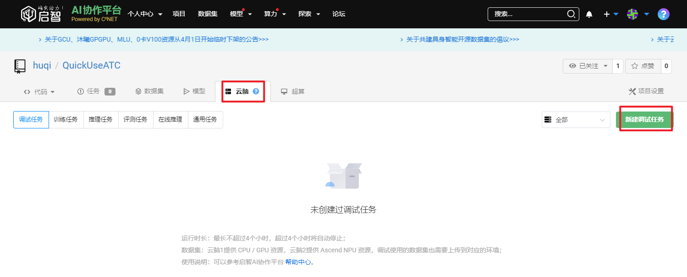
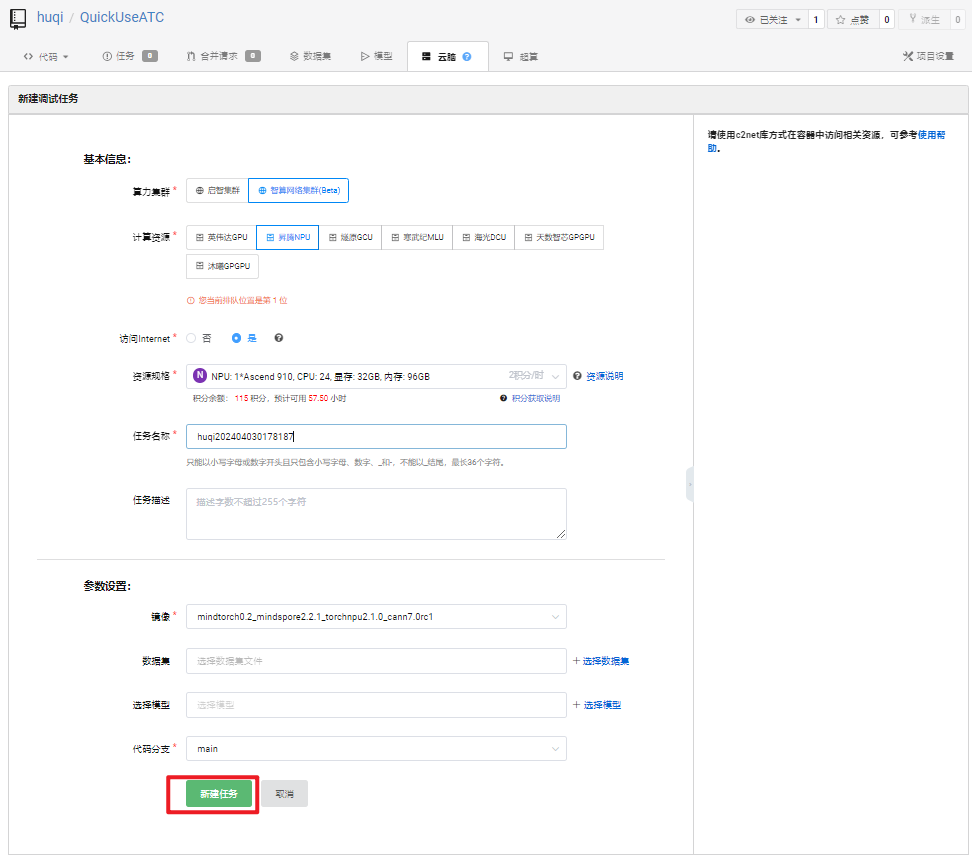
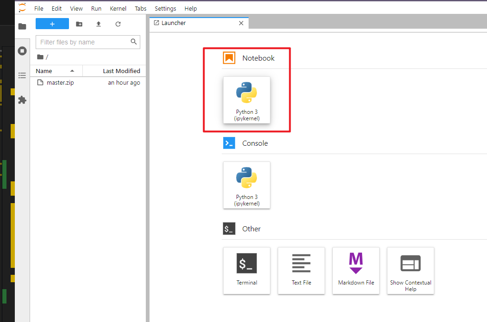
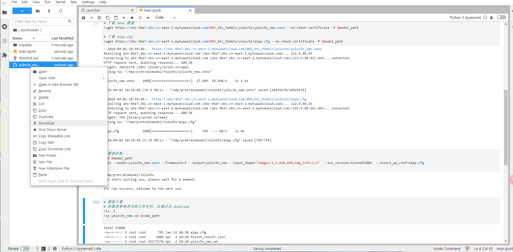

# 快速使用 ATC

> 本仓库将详细介绍如何借助[启智社区][1]昇腾算力 910/910B 进行模型转换，彻底告别开发板上模型转换各种报错的痛苦。

TODO：

- [ ] 完成数据集、模型存储教程
- [ ] 完成训练&模型转换教程
- [ ] 完成 ATC 其他功能教程

## Fork 本仓库

1. 打开[本仓库][2]
2. 点击右上角的`派生`按钮

## 创建云脑 NPU 调试任务

1. 点击`云脑`-`新建调试任务`



2. 配置算力资源及镜像

  - 算力集群：`智算网络集群(Beta)`
  - 计算资源： `昇腾NPU`
  - 访问Interne： `是`
  - 资源规格：`NPU: 1*Ascend-D910B, CPU: 20, 显存: 32GB, 内存: 60GB`
  - 任务名称&任务描述： 按需自定义
  - 镜像： `mindtorch0.2_mindspore2.2.1_torchnpu2.1.0_cann7.0rc1`
  - 数据集： 按需选择
  - 选择模型： 按需选择
  - 代码分支：`main`

3. 点击`新建任务`创建调试任务



*更多细节请参考[云脑调试任务][3]*

## 使用 ATC 进行模型转换

> 本仓库以`yolov5s`为例，介绍如何使用 ATC 进行模型转换。

1. 先点击`云脑`-`调试任务`-`调试`打开开发环境


2. 打开 notebook



3. 写入代码并运行

```ipynb
# 通过c2net库方式获取模型、数据集和输出路径

# 安装 c2net
!pip install -U c2net
# 导入包
from c2net.context import prepare, upload_output
# 初始化导入数据集和预训练模型到容器内
c2net_context = prepare()

# 获取代码路径，数据集路径，预训练模型路径，输出路径
code_path = c2net_context.code_path + "/" + "QuickUseATC".lower()
dataset_path = c2net_context.dataset_path
pretrain_model_path = c2net_context.pretrain_model_path
```


接着就能看到 `quickuseatc` 目录，可点击运行 `main.ipynb` 体验 ATC 模型转换

4. 最终我们可以把转换好的模型拷贝到工作空间进行下载



5. 当然最后别忘了停止调试，否则算力资源会被白白浪费掉哦


## 后记

如果本仓库有不当之处，欢迎指正。感谢！

<!-- 引用链接 -->

[1]: <https://openi.org.cn/> "启智社区"
[2]: <https://openi.pcl.ac.cn/huqi/QuickUseATC> "快速使用 ATC"
[3]: <https://openi.pcl.ac.cn/docs/index.html#/cloudbrain/debug/debug> "云脑调试任务"
