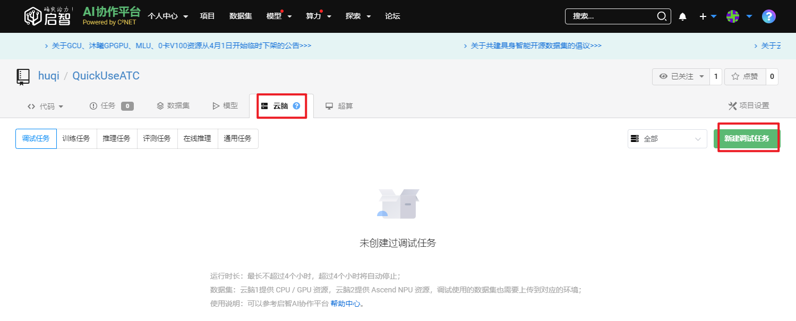
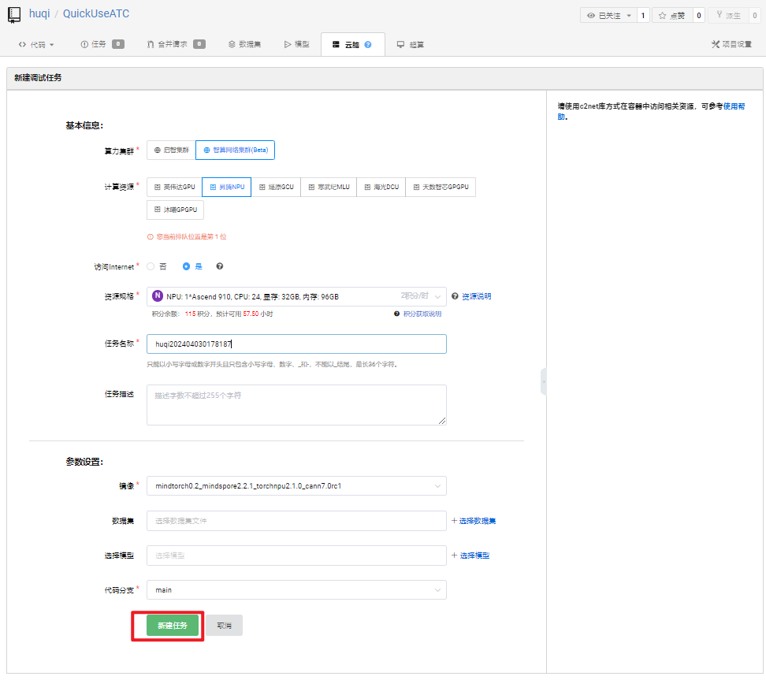
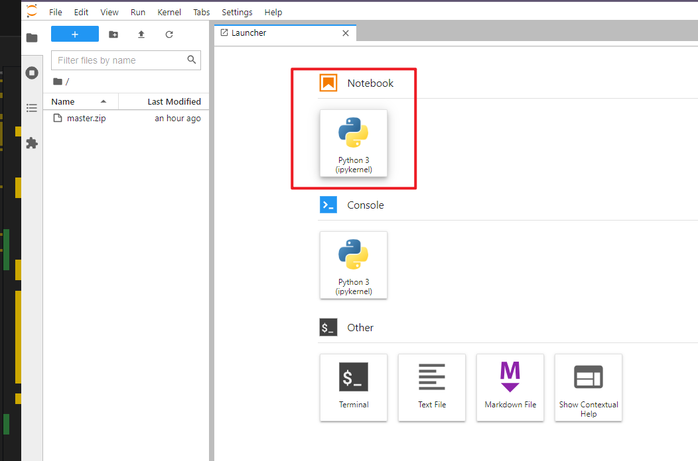
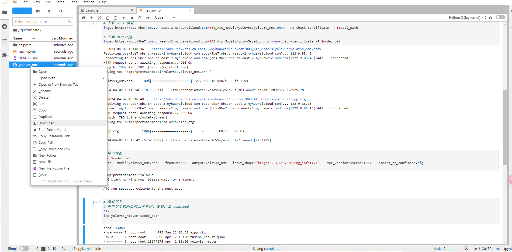
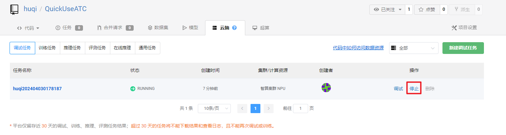

# Quick Use ATC

> This repository will provide detailed tutorials on how to use the ATC of the AISC to convert models on the MindSpore 2.2.1 platform and the NPU 910/910B. Let's put an end to the pain of model conversion on the development board!

TODO:

- [ ] Complete data set and model storage tutorial
- [ ] Complete training and model conversion tutorial
- [ ] Complete ATC other functions tutorial

## Fork this repository

1. Open [this repository][2]
2. Click the upper right corner's "Fork" button

## Create a cloudbrain debug task

1. Click "Cloudbrain"-"New Debug Task"



2. Configure and image

  - Cluster: `Zhipu AI Cluster (Beta)`
  - Calculation Resource: `Ascend NPU`
  - Is Accessible: `Yes`
  - Resource Specification: `NPU: 1*Ascend-D910B, CPU: 20, Memory: 32GB, Disk: 60GB`
  - Task Name & Task Description: Customize as needed
  - Image: `mindtorch0.2_mindspore2.2.1_torchnpu2.1.0_cann7.0rc1`
  - Dataset: Select as needed
  - Choose Model: Choose as needed
  - Code Branch: `main`

3. Click "Create Task" to create the debug task



*More details can be found in the [cloudbrain debug task][3] documentation.

## Use ATC to convert models

> This repository will use the yolov5s model to demonstrate how to use ATC to convert models.

1. First, click "Cloudbrain"-"Debug Task"-"Debug" to open the development environment


2. Open the notebook



3. Write and run the code

```ipynb
# Install c2net and import necessary libraries
!pip install -U c2net
from c2net.context import prepare, upload_output

# Initialize the data set and pre-trained model in the container
c2net_context = prepare()

# Get the code path, data set path, pre-trained model path, and output path
code_path = c2net_context.code_path + "/" + "QuickUseATC".lower()
dataset_path = c2net_context.dataset_path
pretrain_model_path = c2net_context.pretrain_model_path
```

4. We can then see the `quickuseatc` directory, and click to run the `main.ipynb` file to experience the ATC model conversion.

5. Finally, we can copy the converted model to the work space for download and stop the debug task to save resources.





After using this repository, you should be familiar with how to use the ATC of the AISC to convert models on the MindSpore 2.2.1 platform and the NPU 910/910B. Thank you for your support!

<!-- resource -->

[1]: <https://openi.pcl.ac.cn/user/sign_up?sharedUser=huqi> "OpenI"
[2]: <https://openi.pcl.ac.cn/huqi/QuickUseATC> "Quick use ATC"
[3]: <https://openi.pcl.ac.cn/docs/index.html#/cloudbrain/debug/debug> "debug task"
